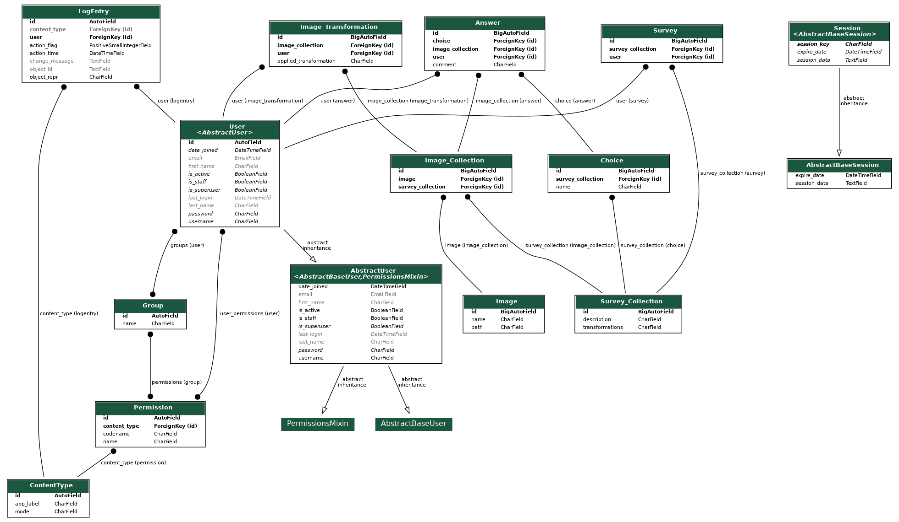

# Survey Project

## Setup
`python manage.py runserver 0:8000`

## Database Image:


## Upcoming Features:
- [X] User login page
- [X] User registration page
- [X] Administration Panel
- [X] Results Page
- [ ] Home page with project description
- [X] Grid Collection Images view
- [X] Jump to unvoted images
- [X] Zoomed Collection Images view
- [X] Use of Ajax for form submit
- [X] Use of a script to create/modify collection with a YAML configuration file 

### TODO List:
- [X] Define DB structure
- [X] Write a grid view
- [X] Create a checkbox to visualize only unvoted images
- [X] Create a new view to serve server with the image in base64
- [X] Apply Image transformations with pillow and offuscate path in base64
- [X] Create an upload image script with yaml language
- [X] Use ajax for the management of the forms on the website
- [X] Insert a next and previews button near the zoomed image
- [X] Insert the checkbox to visualize only unvoted images in the zoomed image view
- [X] Connect the Image Collection Loader script with the admin panel view
- [X] Create a results page connected to the administration panel

### Database Scheme:
This is the link to [DB Designer Scheme](https://dbdesigner.page.link/egjKR3X2GqZGYSDZ8)

### YAML Image Collection File Example:
```
# Definition of a new image collection
collection:
    id: 1                                               # Insert id if you want to add something to an existing collection
    description: "Description of the collection"
    transformations: ['flip(0.5)', 'mirror(0.5)', 'contrast(0.2)']  # Write transformation that can be applied with its probability

    images:
        -   path: "survey/images/image1.jpg"
            name: "image1"                              # name can be omitted, default is the filename without extension
        -   path: "survey/images/image2.jpg"
        -   path: "survey/images/image3.jpg"

    choices:                                            # List new choices for the current image collection
        -   name: "Collection1_Option1"
        -   name: "Collection1_Option2"
        -   name: "Collection1_Option3"
        -   name: "Collection1_Option4"

    users: ['prova1', 'prova2']                         # list new users who will get the access to the collection
```